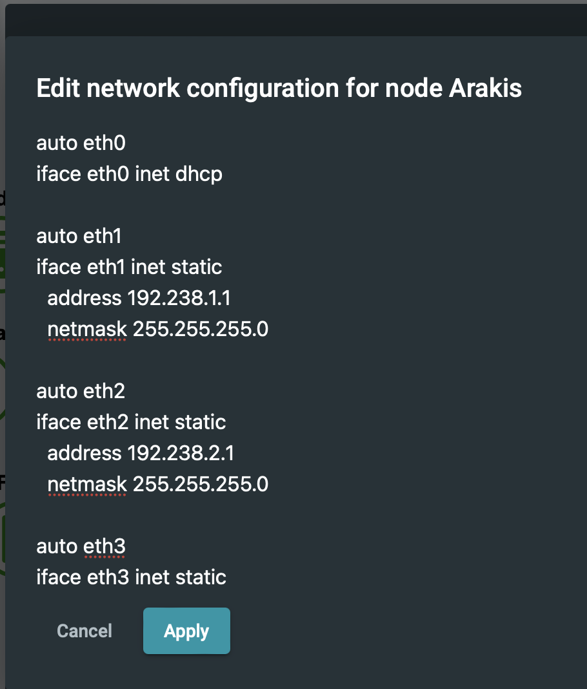
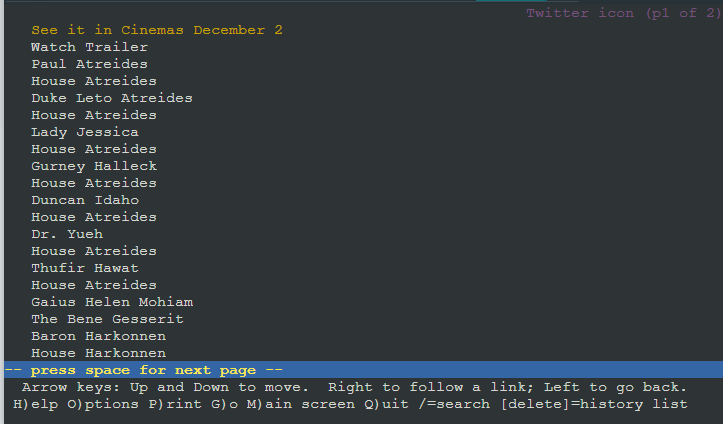
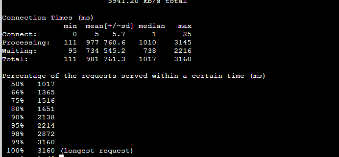

# Jarkom-Modul-3-IT10-2024


# Anggota Kelompok
| Nama | NRP |
| ---------------------- | ---------- |
| Khansa Adia Rahma      | 5027221071 |
| Gilang Raya Kurnaiwan   | 5027221045 |

# Topologi
Pertama buat Topologi sebagai berikut:


# Konfigurasi
Edit network configuration sebagai berikut:
- Arakis (DHCP Relay)

lengkapnya sebagai berikut:
```
auto eth0
iface eth0 inet dhcp

auto eth1
iface eth1 inet static
    address 192.238.1.1
    netmask 255.255.255.0

auto eth2
iface eth2 inet static
    address 192.238.2.1
    netmask 255.255.255.0

auto eth3
iface eth3 inet static
    address 192.238.3.1
    netmask 255.255.255.0

auto eth4
iface eth4 inet static
    address 192.238.4.1
    netmask 255.255.255.0
```

- Dmitri (Client)
```
auto eth0
iface eth0 inet static
  address 192.238.1.2
  netmask 255.255.255.0
  gateway 192.238.1.1
```

- Vladimir (Worker PHP)
```
auto eth0
iface eth0 inet static
  address 192.238.1.3
  netmask 255.255.255.0
  gateway 192.238.1.1
```

- Rabban (Worker PHP)
```
auto eth0
iface eth0 inet static
  address 192.238.1.4
  netmask 255.255.255.0
  gateway 192.238.1.1
```

- Feyd (Worker PHP)
```
auto eth0
iface eth0 inet static
  address 192.238.1.5
  netmask 255.255.255.0
  gateway 192.238.1.1
```

- irulan (DNS Server)
```
auto eth0
iface eth0 inet static
  address 192.238.3.2
  netmask 255.255.255.0
  gateway 192.238.3.1
```

- Mohiam (DHCP Server)
```
auto eth0
iface eth0 inet static
  address 192.238.3.3
  netmask 255.255.255.0
  gateway 192.238.3.1
```

- chani (Database Server)
```
auto eth0
iface eth0 inet static
  address 192.238.4.2
  netmask 255.255.255.0
  gateway 192.238.4.1
```

- stilgar (Load Balancer)
```
auto eth0
iface eth0 inet static
  address 192.238.4.3
  netmask 255.255.255.0
  gateway 192.238.4.1
```

- paul (Client)
```
auto eth0
iface eth0 inet static
  address 192.238.2.2
  netmask 255.255.255.0
  gateway 192.238.2.1
```

- leto (Worker Laravel)
```
auto eth0
iface eth0 inet static
  address 192.238.2.3
  netmask 255.255.255.0
  gateway 192.238.2.1
```

- duncan (Worker Laravel)
```
auto eth0
iface eth0 inet static
  address 192.238.2.4
  netmask 255.255.255.0
  gateway 192.238.2.1
```

- jessica (Worker Laravel)
```
auto eth0
iface eth0 inet static
  address 192.238.2.5
  netmask 255.255.255.0
  gateway 192.238.2.1
```

Selanjutnya, pada root tambahkan juga script berikut

1. pada nodes Arakis
```
cd
nano script.sh
```
tambahkan ke dalam script.sh dengan isi sebagai berikut:
```
iptables -t nat -A POSTROUTING -o eth0 -j MASQUERADE -s 192.238.0.0/16
echo nameserver 192.168.122.1 > /etc/resolv.conf
```

untuk menjalankannya: ``bash script.sh``

apabila terdapat pertanyaan seperti dibawah ini, bisa dijawab dengan: 

```
# What servers should the DHCP relay forward requests to?
SERVERS="192.238.3.3"

# On what interfaces should the DHCP relay (dhrelay) serve DHCP requests?
INTERFACES="eth0 eth1 eth2 eth3 eth4"

# Additional options that are passed to the DHCP relay daemon?
OPTIONS=""
```

2. Pada semua nodes lakukan berikut ini:
``nano script.sh``
```
echo nameserver 192.168.122.1 > /etc/resolv.conf
apt-get update
```
tambahkan juga script instalasi berikut pada node:
- *Mohiam* (DHCP Server): ``apt-get install isc-dhcp-server``
- *Irulan* (DNS Server): ``apt-get install bind9``
- *Arakis* (DHCP Relay): ``apt-get install isc-dhcp-relay``
- *Vladimir, Rabban, Feyd* (Worker PHP): ``apt-get install php7.3``
- *Stilgar* (Load Balancer): 
```
apt-get install nginx
apt-get install apache2-utils
```
- *Chani* (Database Server): ``apt-get install mysql-server``
- *Leto, Duncan, Jessica* (Worker Laravel): 
```
apt-get install php8.0
apt-get install composer
```
# No 1. 
Untuk mengatur agar semua client *Dmitri dan Paul* menggunakan konfigurasi dari DHCP Server *Mohiam*

Bagian ini sudah termasuk di config sebelumnya, yaitu
```
echo "auto eth0
iface eth0 inet dhcp" > /etc/network/interfaces.d/eth0
```
Sehingga client Dmitri dan Paul akan secara otomatis meminta IP address dari DHCP Server (Mohiam) ketika startup atau restart jaringan.

# No 2,3,5.
Client yang melalui House Harkonen mendapatkan range IP dari [prefix IP].1.14 - [prefix IP].1.28 dan [prefix IP].1.49 - [prefix IP].1.70 (2)

Client yang melalui House Atreides mendapatkan range IP dari [prefix IP].2.15 - [prefix IP].2.25 dan [prefix IP].2 .200 - [prefix IP].2.210 (3)

Durasi DHCP server meminjamkan alamat IP kepada Client yang melalui House Harkonen selama 5 menit sedangkan pada client yang melalui House Atreides selama 20 menit. Dengan waktu maksimal dialokasikan untuk peminjaman alamat IP selama 87 menit (5)
*house == switch

- Pada script.sh di root Arakis
```
echo nameserver 192.168.122.1 > /etc/resolv.conf
apt-get update
apt-get install isc-dhcp-relay

service isc-dhcp-relay start

echo -e 'SERVERS="192.238.3.3"
INTERFACES="eth0 eth1 eth2 eth3"
OPTIONS='> /etc/default/isc-dhcp-relay 
```

jalankan ``bash script.sh``


- pada DHCP Server yaitu *Mohiam*, tambahkan konfigurasi berikut ke dalam file ``/etc/dhcp/dhcpd.conf`` untuk mengatur rentang IP Sesuai dengan ketentuan:

```
echo nameserver 192.168.122.1 > /etc/resolv.conf
apt update
apt install isc-dhcp-server -y

# Set interface untuk DHCP Server
echo 'INTERFACESv4="eth0"' > /etc/default/isc-dhcp-server

# Konfigurasi DHCP Server
# DHCP Server Configuration file.
echo 'subnet 192.238.3.0 netmask 255.255.255.0 {
}

# Konfigurasi subnet untuk House Harkonen
subnet 192.238.1.0 netmask 255.255.255.0 {
    range 192.238.1.14 192.238.1.28;
    range 192.238.1.49 192.238.1.70;
    option routers 192.238.1.1;
    option domain-name-servers 192.238.3.2;
    default-lease-time 300; # 5 minutes
    max-lease-time 5220; # 87 minutes
}

# Konfigurasi subnet untuk House Atreides
subnet 192.238.2.0 netmask 255.255.255.0 {
    range 192.238.2.15 192.238.2.25;
    range 192.238.2.200 192.238.2.210;
    option routers 192.238.2.1;
    option domain-name-servers 192.238.3.2;
    default-lease-time 1200; # 20 minutes
    max-lease-time 5220; # 87 minutes
}
' > /etc/dhcp/dhcpd.conf

service isc-dhcp-server start
service isc-dhcp-server status

```
jalankan ``./script.sh``


# No 4.
Client mendapatkan DNS dari Princess Irulan dan dapat terhubung dengan internet melalui DNS tersebut. 

pada *irulan*, atur script sbg berikut
```
echo nameserver 192.168.122.1 > /etc/resolv.conf
# Instalasi DNS Server
apt update
apt install bind9 -y
apt install dnsutils -y

# Konfigurasi DNS Server
echo "
options {
    directory \"/var/cache/bind\";

    forwarders {
        192.168.122.1
    };

    dnssec-validation auto;

    listen-on-v6 { any; };
};
" > /etc/bind/named.conf.options

echo "
zone \"atreides.it10.com\" {
    type master;
    file \"/etc/bind/db.atreides.it10.com\";
};

zone \"harkonen.it10.com\" {
    type master;
    file \"/etc/bind/db.harkonen.it10.com\";
};
" > /etc/bind/named.conf.local

echo "
\$TTL    604800
@       IN      SOA     ns.atreides.it10.com. root.atreides.it10.com. (
                              2         ; Serial
                         604800         ; Refresh
                          86400         ; Retry
                        2419200         ; Expire
                         604800 )       ; Negative Cache TTL
;
@       IN      NS      ns.atreides.it10.com.
ns      IN      A       192.238.3.2
leto    IN      A       192.238.2.3
duncan  IN      A       192.238.2.4
jessica IN      A       192.238.2.5
" > /etc/bind/db.atreides.it10.com

echo "
\$TTL    604800
@       IN      SOA     ns.harkonen.it10.com. root.harkonen.it10.com. (
                              2         ; Serial
                         604800         ; Refresh
                          86400         ; Retry
                        2419200         ; Expire
                         604800 )       ; Negative Cache TTL
;
@       IN      NS      ns.harkonen.it10.com.
ns      IN      A       192.238.3.2
vladimir IN     A       192.238.1.3
rabban  IN      A       192.238.1.4
feyd    IN      A       192.238.1.5
" > /etc/bind/db.harkonen.it10.com

# Restart DNS Server
service bind9 restart
```
jalankan ``./script.sh``


## Verifikasi DNS Server di Irulan:
```
dig @localhost atreides.it10.com
dig @localhost harkonen.it10.com
```


## Tes Resolusi DNS dengan nslookup:
``nslookup mydomain.com 192.238.3.2``


# No 6.
Vladimir Harkonen memerintahkan setiap worker(harkonen) PHP, untuk melakukan konfigurasi virtual host untuk website berikut dengan menggunakan php 7.3.

Pada masing-masing worker Harkonen (Vladimir, Rabban, dan Feyd):
```
echo nameserver 192.168.122.1 > /etc/resolv.conf
apt-get update
apt-get install nginx -y
apt-get install wget -y
apt-get install unzip -y
apt-get install lynx -y
apt-get install htop -y
apt-get install apache2-utils -y
apt-get install php7.3-fpm php7.3-common php7.3-mysql php7.3-gmp php7.3-curl ph$

wget -O '/var/www/harkonen.it10.com' 'https://drive.google.com/file/d/1lmnXJUbyx1JDt2OA5z_1dEowxozfkn30/view?usp=sharing’

unzip -o /var/www/harkonen.it10.com  -d /var/www/

cp /etc/nginx/sites-available/default /etc/nginx/sites-available/harkonen.it10.com

# Konfigurasi Virtual Host
echo 'server {
    listen 80;
    server_name _;

    root /var/www/harkonen;
    index index.php index.html index.htm;

    location / {
        try_files $uri $uri/ /index.php?$query_string;
    }

location ~ \.php$ {
        include snippets/fastcgi-php.conf;
        fastcgi_pass unix:/run/php/php7.3-fpm.sock;  # Sesuaikan versi PHP dan $
        fastcgi_param SCRIPT_FILENAME $document_root$fastcgi_script_name;
        include fastcgi_params;
    }
}' > /etc/nginx/sites-available/harkonen.it10.com

service php7.3-fpm start
```
jalankan dengan ``bash script.sh`` pada *Vladimir, Rabban, dan Feyd*


Nantinya akan muncul seperti berikut:


# No 7.
Aturlah agar Stilgar dari fremen dapat dapat bekerja sama dengan maksimal, lalu lakukan testing dengan 5000 request dan 150 request/second.

- Modifikasi node irulan ``nano /etc/bind/dune/harkonen.it10.com`` sebagai berikut
```
;
; BIND data file for local loopback interface
;
$TTL	604800
@   	IN  	SOA 	harkonen.it10.com. root.harkonen.it10.com. (
                          	2     	; Serial
                     	604800     	; Refresh
                      	86400     	; Retry
                    	2419200     	; Expire
                     	604800 )   	; Negative Cache TTL
;
@   	IN  	NS  	harkonen.it10.com.
@   	IN  	A   	192.238.4.2	; IP Stilgar load bal 
www 	IN  	CNAME   harkonen.it10.com.
```

dan pada ``nano /etc/bind/dune/atreides.it10.com``

```
;
; BIND data file for local loopback interface
;
$TTL	604800
@   	IN  	SOA 	atreides.it10.com. root.atreides.it10.com. (
                          	2     	; Serial
                     	604800     	; Refresh
                      	86400     	; Retry
                    	2419200     	; Expire
                     	604800 )   	; Negative Cache TTL
;
@   	IN  	NS  	atreides.it10.com.
@   	IN  	A   	192.238.4.2 	; IP Stilgar load bal
www 	IN  	CNAME   atreides.it10.com.
```
- Selanjutnya, pada node *stilgar*
```
echo ' upstream worker {
    server 192.238.1.1;
    server 192.238.1.2;
    server 192.238.1.3;
}

server {
    listen 80;
    server_name harkonen.it10.com www.harkonen.it10.com;

    root /var/www/html;

    index index.html index.htm index.nginx-debian.html;

    server_name _;

    location / {
        proxy_pass http://worker;
    }
} ' > /etc/nginx/sites-available/lb-stilgar

ln -s /etc/nginx/sites-available/lb-stilgar /etc/nginx/sites-enabled

rm /etc/nginx/sites-enabled/default

service nginx restart

service php7.3-fpm restart
```

- selanjutnya, kita cek pada salah satu client untuk melakukan testing dengan 5000 request dan 150 concurrent
``ab -n 5000 -c 150 http://www.harkonen.it10.com/``


# No 8.
Karena diminta untuk menuliskan peta tercepat menuju spice, buatlah analisis hasil testing dengan 500 request dan 50 request/second masing-masing algoritma Load Balancer dengan ketentuan sebagai berikut:
a. Nama Algoritma Load Balancer
b. Report hasil testing pada Apache Benchmark
c. Grafik request per second untuk masing masing algoritma. 
d. Analisis (8)

Pada node Stilgar, ganti konfigurasi load balancer di ``/etc/nginx/conf.d/load_balancer.conf`` sesuai algoritma yang diinginkan.

di sini menggunakan algoritma ``Least Connected``:
```
upstream backend {
    least_conn;
    server 192.238.1.8;
    server 192.238.1.9;
    server 192.238.1.10;
}
```

Melakukan testing dengan Apache Benchmark: ``ab -n 500 -c 50 http://192.238.0.5/``

# No 9.
Dengan menggunakan algoritma Least-Connection, lakukan testing dengan menggunakan 3 worker, 2 worker, dan 1 worker sebanyak 1000 request dengan 10 request/second, kemudian tambahkan grafiknya pada peta. (9)

Pada node Stilgar, ganti konfigurasi load balancer di ``/etc/nginx/conf.d/load_balancer.conf`` menjadi:
```
upstream backend {
    least_conn;
    server 192.238.1.8;
    server 192.238.1.9;
    server 192.238.1.10;
}
```

- Melakukan testing:
``ab -n 500 -c 50 http://www.harkonen.it10.com/``

dengan ``1 worker``


dengan ``2 worker``


dengan ``3 worker``


# No 10.
Selanjutnya coba tambahkan keamanan dengan konfigurasi autentikasi di LB dengan dengan kombinasi username: “secmart” dan password: “kcksyyy”, dengan yyy merupakan kode kelompok. Terakhir simpan file “htpasswd” nya di /etc/nginx/supersecret/ (10)

`` mkdir /etc/nginx/supersecret ``

`` htpasswd -c /etc/nginx/supersecret/htpasswd secmart``

``passwd kcksyyy``

Selanjutnya, pada /etc/nginx/sites-available/lb_php tambahkan script berikut:

```
echo ' upstream worker {
    server 192.238.1.1;
    server 192.238.1.2;
    server 192.238.1.3;
}

server {
    listen 80;
    server_name harkonen.it10.com www.harkonen.it10.com;

    root /var/www/html;

    index index.html index.htm index.nginx-debian.html;

    server_name _;

    location / {
         proxy_pass http://worker;
        auth_basic "Restricted Content";
        auth_basic_user_file /etc/nginx/supersecret/htpasswd;
    }
} ' > /etc/nginx/sites-available/lb-stilgar


ln -s /etc/nginx/sites-available/lb-stilgar /etc/nginx/sites-enabled
cek

lynx http://www.harkonen.it10.com/
```


# No 11. 
Lalu buat untuk setiap request yang mengandung /dune akan di proxy passing menuju halaman https://www.dunemovie.com.au/. (11) hint: (proxy_pass)

Pada node Stilgar, tambahkan script berikut:

```
echo 'upstream worker {
    server 192.238.1.1;
    server 192.238.1.2;
    server 192.238.1.3;
}

server {
    listen 80;
    server_name harkonen.it10.com www.harkonen.it10.com;

    root /var/www/html;
    
    index index.html index.htm index.nginx-debian.html;

    location / {
    	auth_basic "Restricted Content";
    	auth_basic_user_file /etc/nginx/supersecret/htpasswd;
    	proxy_pass http://worker;
    }

    location /dune/ {
   	 proxy_pass https://www.dunemovie.com.au/;
   	 proxy_set_header Host www.dunemovie.com.au;
   	 proxy_set_header X-Real-IP $remote_addr;
   	 proxy_set_header X-Forwarded-For $proxy_add_x_forwarded_for;
   	 proxy_set_header X-Forwarded-Proto $scheme;
    }
}' > /etc/nginx/sites-available/lb-stilgar
```

Setelah itu, cek dengan ``lynx www.harkonen.it10.com/dune/``


# No 12. 
Selanjutnya LB ini hanya boleh diakses oleh client dengan IP [Prefix IP].1.37, [Prefix IP].1.67, [Prefix IP].2.203, dan [Prefix IP].2.207. (12) hint: (fixed in dulu clientnya)

Mengonfigurasi Pembatasan Akses pada Load Balancer (Stilgar), maka
Pada node Stilgar, tambahkan script berikut:
```
upstream worker {
	server 192.238.1.1;
	server 192.238.1.2;
	server 192.238.1.3;
}

server {
	listen 80;
	server_name harkonen.it10.com www.harkonen.it10.com;

	root /var/www/html;
	index index.html index.htm index.nginx-debian.html;

	location / {
    	auth_basic "Restricted Content";
    	auth_basic_user_file /etc/nginx/supersecret/htpasswd;
    	allow 192.238.1.37;
    	allow 192.238.1.67;
    	allow 192.238.2.203;
    	allow 192.238.2.207;
    	deny all;
    	proxy_pass http://worker;
	}

	location /dune/ {
    	proxy_pass https://www.dunemovie.com.au/;
    	proxy_set_header Host www.dunemovie.com.au;
    	proxy_set_header X-Real-IP $remote_addr;
    	proxy_set_header X-Forwarded-For $proxy_add_x_forwarded_for;
    	proxy_set_header X-Forwarded-Proto $scheme;
	}
} ' > /etc/nginx/sites-available/lb-stilgar

rm  /etc/nginx/sites-enabled/lb-stilgar


ln -s /etc/nginx/sites-available/lb-stilgar /etc/nginx/sites-enabled
```

Lakukan cek menggunakan ``lynx www.harkonen.it10.com``


# No 13. 
Tidak mau kalah dalam perburuan spice, House atreides juga mengatur para pekerja di atreides.yyy.com.
Semua data yang diperlukan, diatur pada Chani dan harus dapat diakses oleh Leto, Duncan, dan Jessica. (13)

Pada node chani agar data yg diperlukan dapat diakses oleh leto, duncan, dan jessica maka edit script sebagai berikut pada ``nano /etc/mysql/my.cnf``

```
# Options affecting the MySQL server (mysqld)
[mysqld]
skip-networking=0
skip-bind-address
```
Lalu pada ``nano /etc/mysql/mariadb.conf.d/50-server.cnf``
tambahkan berikut ini: ``bind_adress = 0.0.0.0``

jalankan ``service mysql restart``

Selanjutnya masih pada node chani, masuk ke mysql dengan ``mysql -u root -p``

dengan password: ``it10``

```
-- Create the user with access from any host
CREATE USER 'kelompokit10'@'%' IDENTIFIED BY 'kelompokit10';

-- Create the user with access from localhost
CREATE USER 'kelompokit10'@'localhost' IDENTIFIED BY 'kelompokit10';

-- Create the database
CREATE DATABASE dbkelompoka10;

-- Grant all privileges on the specific database to the user for any host
GRANT ALL PRIVILEGES ON dbkelompoka10.* TO 'kelompokit10'@'%';

-- Grant all privileges on the specific database to the user for localhost
GRANT ALL PRIVILEGES ON dbkelompoka10.* TO 'kelompokit10'@'localhost';

-- Apply the changes
FLUSH PRIVILEGES;
```

Selanjutnya cek pada worker laravel:
```
mariadb --host=192.238.4.1 --port=3306 --user='kelompokit10' --password='kelompokit10' -e "SHOW DATABASES;" dbkelompoka10


mariadb --host=192.238.4.1 --port=3306 --user='kelompokit10' --password='kelompokit10' -e "SHOW TABLES;" dbkelompoka10


mariadb --host=192.238.4.1 --port=3306 --user='kelompokit10' --password='kelompokit10' --verbose --execute="SELECT * FROM users;" dbkelompoka10
```


# No 14.
Leto, Duncan, dan Jessica memiliki atreides Channel sesuai dengan quest guide berikut. Jangan lupa melakukan instalasi PHP8.0 dan Composer (14)

- Pada node stilgar, edit script pada ``nano /etc/nginx/sites-available/laravel-worker`` dengan berikut ini: 

```
# Combined upstream configuration
upstream worker {
	# Workers for harkonen.it10.com
	server 192.238.1.1;
	server 192.238.1.2;
	server 192.238.1.3;

	# Workers for atreides.it10.com
	server 192.238.2.1:8001;
	server 192.238.2.2:8002;
	server 192.238.2.3:8003;
}

# Server block for harkonen.it10.com
server {
	listen 80;
	server_name harkonen.it10.com www.harkonen.it10.com;

	root /var/www/html;
	index index.html index.htm index.nginx-debian.html;

	location / {
    	auth_basic "Restricted Content";
    	auth_basic_user_file /etc/nginx/supersecret/htpasswd;
    	allow 192.238.1.37;
    	allow 192.238.1.67;
    	allow 192.238.2.203;
    	allow 192.238.2.207;
    	deny all;
    	proxy_pass http://worker;
	}

	location /dune/ {
    	proxy_pass https://www.dunemovie.com.au/;
    	proxy_set_header Host www.dunemovie.com.au;
    	proxy_set_header X-Real-IP $remote_addr;
    	proxy_set_header X-Forwarded-For $proxy_add_x_forwarded_for;
    	proxy_set_header X-Forwarded-Proto $scheme;
	}
}

# Server block for atreides.it10.com
server {
	listen 80;
	server_name atreides.it10.com www.atreides.it10.com;

	location / {
    	proxy_pass http://worker;
	}
}


ln -s /etc/nginx/sites-available/laravel-worker /etc/nginx/sites-enabled/laravel-worker
```

- Semuanya pada semua node laravel worker yaitu (dunca, jessica, dan leto)
1. install composer: 
```
wget https://getcomposer.org/download/2.0.13/composer.phar

chmod +x composer.phar

mv composer.phar /usr/local/bin/composer
```

2. install git: ``apt-get install git -y``

3. Lakukan clone: 
```
cd /var/www && git clone https://github.com/martuafernando/laravel-praktikum-jarkom

cd /var/www/laravel-praktikum-jarkom && composer update
```

4. Lakukan konfigurasi sebagai berikut pada masing-masing worker:
```
cd /var/www/laravel-praktikum-jarkom && cp .env.example .env

echo 'APP_NAME=Laravel
APP_ENV=local
APP_KEY=
APP_DEBUG=true
APP_URL=http://localhost

LOG_CHANNEL=stack
LOG_DEPRECATIONS_CHANNEL=null
LOG_LEVEL=debug

DB_CONNECTION=mysql
DB_HOST=192.238.4.1
DB_PORT=3306
DB_DATABASE=dbkelompoka10
DB_USERNAME=kelompokit10
DB_PASSWORD=kelompokit10

BROADCAST_DRIVER=log
CACHE_DRIVER=file
FILESYSTEM_DISK=local
QUEUE_CONNECTION=sync
SESSION_DRIVER=file
SESSION_LIFETIME=120

MEMCACHED_HOST=127.0.0.1

REDIS_HOST=127.0.0.1
REDIS_PASSWORD=null
REDIS_PORT=6379

MAIL_MAILER=smtp
MAIL_HOST=mailpit
MAIL_PORT=1025
MAIL_USERNAME=null
MAIL_PASSWORD=null
MAIL_ENCRYPTION=null
MAIL_FROM_ADDRESS="hello@example.com"
MAIL_FROM_NAME="${APP_NAME}"

AWS_ACCESS_KEY_ID=
AWS_SECRET_ACCESS_KEY=
AWS_DEFAULT_REGION=us-east-1
AWS_BUCKET=
AWS_USE_PATH_STYLE_ENDPOINT=false

PUSHER_APP_ID=
PUSHER_APP_KEY=
PUSHER_APP_SECRET=
PUSHER_HOST=
PUSHER_PORT=443
PUSHER_SCHEME=https
PUSHER_APP_CLUSTER=mt1

VITE_PUSHER_APP_KEY="${PUSHER_APP_KEY}"
VITE_PUSHER_HOST="${PUSHER_HOST}"
VITE_PUSHER_PORT="${PUSHER_PORT}"
VITE_PUSHER_SCHEME="${PUSHER_SCHEME}"
VITE_PUSHER_APP_CLUSTER="${PUSHER_APP_CLUSTER}"' > /var/www/laravel-praktikum-jarkom/.env
```
Selanjutnya, 

```
cd /var/www/laravel-praktikum-jarkom && php artisan key:generate
cd /var/www/laravel-praktikum-jarkom && php artisan config:cache
cd /var/www/laravel-praktikum-jarkom && php artisan migrate
cd /var/www/laravel-praktikum-jarkom && php artisan db:seed
cd /var/www/laravel-praktikum-jarkom && php artisan storage:link
cd /var/www/laravel-praktikum-jarkom && php artisan jwt:secret
cd /var/www/laravel-praktikum-jarkom && php artisan config:clear

chown -R www-data.www-data /var/www/laravel-praktikum-jarkom/storage
```

5. Lakukan config sebagai berikut pada ``nano /etc/nginx/sites-available/laravel-worker``

```
server {
	listen 8001; # Leto

	root /var/www/laravel-praktikum-jarkom/public;

	index index.php index.html index.htm;
	server_name _;

	location / {
    	try_files $uri $uri/ /index.php?$query_string;
	}

	# pass PHP scripts to FastCGI server
	location ~ \.php$ {
    	include snippets/fastcgi-php.conf;
    	fastcgi_pass unix:/var/run/php/php8.0-fpm.sock;
	}

	location ~ /\.ht {
    	deny all;
	}

	error_log /var/log/nginx/implementasi_error.log;
	access_log /var/log/nginx/implementasi_access.log;
}

server {
	listen 8002; # Duncan

	root /var/www/laravel-praktikum-jarkom/public;

	index index.php index.html index.htm;
	server_name _;

	location / {
    	try_files $uri $uri/ /index.php?$query_string;
	}

	# pass PHP scripts to FastCGI server
	location ~ \.php$ {
    	include snippets/fastcgi-php.conf;
    	fastcgi_pass unix:/var/run/php/php8.0-fpm.sock;
	}

	location ~ /\.ht {
    	deny all;
	}

	error_log /var/log/nginx/implementasi_error.log;
	access_log /var/log/nginx/implementasi_access.log;
}

server {
	listen 8003; # Jessica

	root /var/www/laravel-praktikum-jarkom/public;

	index index.php index.html index.htm;
	server_name _;

	location / {
    	try_files $uri $uri/ /index.php?$query_string;
	}

	# pass PHP scripts to FastCGI server
	location ~ \.php$ {
    	include snippets/fastcgi-php.conf;
    	fastcgi_pass unix:/var/run/php/php8.0-fpm.sock;
	}

	location ~ /\.ht {
    	deny all;
	}

	error_log /var/log/nginx/implementasi_error.log;
	access_log /var/log/nginx/implementasi_access.log;
}

service nginx restart
service php8.0-fpm restart

ln -s /etc/nginx/sites-available/laravel-worker /etc/nginx/sites-enabled/

rm /etc/nginx/sites-enabled/default
```

6.  Cek dengan: ``lynx localhost:8001``


# No 15. 
atreides Channel memiliki beberapa endpoint yang harus ditesting sebanyak 100 request dengan 10 request/second. Tambahkan response dan hasil testing pada peta.
POST /auth/register (15)

Pada node client tambahkan script berikut:
```
echo '
{
  "username": "kelompokit10",
  "password": "kelompokit10"
}' > register.json
```

Selanjutnya, cek dengan: ``ab -n 100 -c 10 -p register.json -T application/json http://192.238.2.2:8002/api/auth/register``

Pada gambar tersebut terlihat bahwa terdapat 49 failed request atau terdapat request yang gagal sebanyak 49.


Selanjutnya, untuk request yang diterma hanyak terdapat 1 req. 


# No 16.
POST /auth/login (16)

Pada Node Client, tambahkan script berikut ini:
```
echo '
{
  "username": "kelompokit10",
  "password": "kelompokit10"
}' > login.json
```
 Setelah itu, cek dengan: ``ab -n 100 -c 10 -p login.json -T application/json http://192.238.2.2:8002/api/auth/login``


Terlihat pada gambar tersebut bahwa request yang gagal telah berkurang dari yang sebelumnya 49 menjadi 46 req. (Kemungkinan karena performa CPU ataupun Worker)

# No 17.
GET /me (17)

- Pada node client yaitu (Dmitiri dan Paul)
 Lakukan cek token terlebih dahulu, 
 ``curl -X POST -H "Content-Type: application/json" -d @login.json http://192.238.2.2:8002/api/auth/login > login_output.txt``

 ``token=$(cat login_output.txt | jq -r '.token')``

tes juga dengan: ``ab -n 100 -c 10 -H "Authorization: Bearer $token" http://192.238.2.2:8002/api/me``


# No 18.
Untuk memastikan ketiganya bekerja sama secara adil untuk mengatur atreides Channel maka implementasikan Proxy Bind pada Stilgar untuk mengaitkan IP dari Leto, Duncan, dan Jessica. (18)

Pada node stilgar, tambahkan script berikut ke dalam ``/etc/nginx/sites-available/laravel``

```
upstream workers {
    server 192.238.2.1:8001;
	  server 192.238.2.2:8002;
	  server 192.238.2.3:8003;
}

server {
        listen 80;
        server_name atreides.it10.com;

        location / {
        proxy_pass http://workers;
        }
}
```
cek dengan ``ln -s /etc/nginx/sites-available/laravel /etc/nginx/sites-enabled/laravel`` 

Lakukan restart untuk nginx juga dengan ``service nginx restart``

Tes dan cek lagi menggunakan: ``ab -n 100 -c 10 -p login.json -T application/json http://atreides.it10.com/api/auth/login``

# No 19.
Untuk meningkatkan performa dari Worker, coba implementasikan PHP-FPM pada Leto, Duncan, dan Jessica. Untuk testing kinerja naikkan 
- pm.max_children
- pm.start_servers
- pm.min_spare_servers
- pm.max_spare_servers
sebanyak tiga percobaan dan lakukan testing sebanyak 100 request dengan 10 request/second kemudian berikan hasil analisisnya pada PDF.(19)

1. Untuk melakukan percobaan yang pertama, tambahkan script berikut:

```
echo '[www]
user = www-data
group = www-data
listen = /run/php/php8.0-fpm.sock
listen.owner = www-data
listen.group = www-data
php_admin_value[disable_functions] = exec,passthru,shell_exec,system
php_admin_flag[allow_url_fopen] = off

; 
pm = dynamic
pm.max_children = 15
pm.start_servers = 12
pm.min_spare_servers = 3
pm.max_spare_servers = 13' > /etc/php/8.0/fpm/pool.d/www.conf
```

2. Selanjutnya, untuk melakukan percobaan yang kedua:
```
echo '[www]
user = www-data
group = www-data
listen = /run/php/php8.0-fpm.sock
listen.owner = www-data
listen.group = www-data
php_admin_value[disable_functions] = exec,passthru,shell_exec,system
php_admin_flag[allow_url_fopen] = off

; 

pm = dynamic
pm.max_children = 25
pm.start_servers = 22
pm.min_spare_servers = 5
pm.max_spare_servers = 23' > /etc/php/8.0/fpm/pool.d/www.conf
```

3. Lakukan percobaan untuk yang ketiga:
```
echo '[www]
user = www-data
group = www-data
listen = /run/php/php8.0-fpm.sock
listen.owner = www-data
listen.group = www-data
php_admin_value[disable_functions] = exec,passthru,shell_exec,system
php_admin_flag[allow_url_fopen] = off

; 

pm = dynamic
pm.max_children = 5
pm.start_servers = 2
pm.min_spare_servers = 1
pm.max_spare_servers = 3' > /etc/php/8.0/fpm/pool.d/www.conf
```

Restart php dan nginx, Lalu test dengan: ``ab -n 100 -c 10 http://atreides.it10.com/``
# No 20.
Nampaknya hanya menggunakan PHP-FPM tidak cukup untuk meningkatkan performa dari worker maka implementasikan Least-Conn pada Stilgar. Untuk testing kinerja dari worker tersebut dilakukan sebanyak 100 request dengan 10 request/second. (20)

pada node stilgar tambahkan script berikut pada ``/etc/nginx/sites-available/laravel``

```
upstream worker {
    least_conn;
    server 192.238.2.1:8001;
	  server 192.238.2.2:8002;
	  server 192.238.2.3:8003;
}

server {
        listen 80;
        server_name atreides.it10.com;

        location / {
        proxy_pass http://workers;
        }
}
```

Test dan cek dengan: ``ab -n 100 -c 10 http://atreides.it10.com/``